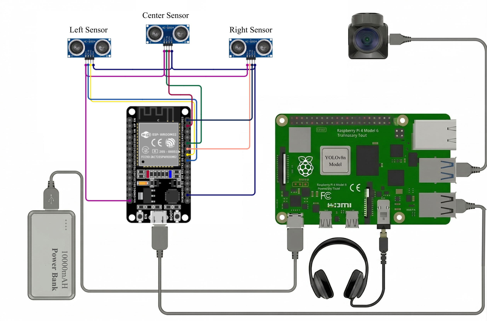

# Smart Cane Companion

An AI-powered, fully offline wearable navigation aid for visually impaired users. It fuses real-time object detection with head-level ultrasonic proximity sensing, and delivers feedback through spatial audio beeps and voice alerts — hands-free, low-latency, and running entirely on edge hardware with no cloud dependency.

<p align="center">
  
</p>

<p align="center">
  <b><a href="docs/hardware-guide.html">▶ Open the interactive hardware guide</a></b>
</p>

## Hardware

| Module | Hardware | Placement | Purpose |
|---|---|---|---|
| **Headband** | 3× ultrasonic sensors (1 front, 2 side) + ESP32 | Worn on the head | Sweeps exactly where the user is looking, for immediate head-level obstacle awareness |
| **Camera** | USB webcam (or smartphone IP camera, `192.168.1.x:8080/video`) | Chest-mounted / hand-held | Stable, hands-free field of view for the vision pipeline |
| **Belt pouch** | Raspberry Pi 4 + power bank (min. 5V/3A) | Worn on the belt | Headless main hub — runs AI inference and audio mixing; powers the camera and ESP32 |
| **Audio out** | Earphones / Bluetooth headphones | In-ear | Voice alerts and spatial proximity beeps |

The ESP32 talks to the Pi over **USB serial**.

## Circuit diagram

<p align="center">
  
</p>


## Software architecture

Multi-process by design, so the AI workload never blocks real-time sensor polling:

```
startup_manager.py  →  launches vision.py and ultrasonic.py as independent
                        parallel subprocesses; verifies camera/serial readiness first
       │
       ├── vision.py        Captures + resizes frames, frame-skips to hold FPS,
       │                    runs YOLO (NCNN) inference, fires voice alerts on a
       │                    separate thread (via paplay) so playback never
       │                    stalls the camera buffer. Uses /dev/shm (RAM-disk)
       │                    for fast inter-process handoff.
       │
       └── ultrasonic.py    Reads serial data from the ESP32, maps proximity
                             readings to Left/Center/Right channels, and plays
                             spatial beeps via pygame. Auto-reconnects on
                             dropped USB serial (try/except loop).
```

### The ML model

- **Architecture:** YOLOv8
- **Training:** dataset curated in Roboflow and some custom dataset, trained on Kaggle Notebooks (cloud GPU)
- **Detects:** Stairs, Vehicles, Doors, Persons — with custom logic that groups overlapping "Person" detections into a single "Crowd ahead" warning
- **Deployment:** `best.pt` (PyTorch) exported to **NCNN** (`best_ncnn_model/`) — NCNN is optimized for ARM/edge devices, giving the Pi stable real-time FPS with no GPU

### Audio system

- `AssistiveTech/sounds/` — per-hazard spoken alerts as `.wav` files (e.g. `Stairs.wav`, `Vehicle.wav`, `Door.wav`, `P-left.wav`, `System Ready.wav`), played via the Linux `paplay` command from `vision.py`. New hazard → speaks immediately; same hazard → enforced >3.5s cooldown before repeating, to avoid nagging.
- `alert.mp3` / `beep.mp3` — general alert/proximity beep pair, used by `ultrasonic.py`/`vision.py` outside the per-hazard `.wav` set. These spatial beeps are panned Left/Center/Right via `pygame`, based on which ultrasonic sensor is closest to an obstacle.


## Setup & run

1. Flash **Raspberry Pi OS 64-bit (Bookworm)**, headless mode with console autologin enabled (`raspi-config`) so audio drivers initialize without a desktop environment.
2. Install system packages:
   ```bash
   sudo apt install pulseaudio-utils
   ```
3. Create and activate the virtual environment:
   ```bash
   python3 -m venv yolo-env
   source yolo-env/bin/activate
   pip install -r requirements.txt
   ```
4. Run:
   ```bash
   python AssistiveTech/startup_manager.py
   ```


## Known issues / TODO

- **Power/USB instability:** running the Pi CPU at max load alongside a USB camera and the ESP32 can cause brief voltage drops → split-second USB disconnects. `ultrasonic.py`'s serial reconnect loop handles this, but a more robust power supply (or powered USB hub) would reduce how often it triggers.

## License

Released under the [MIT License](LICENSE).
